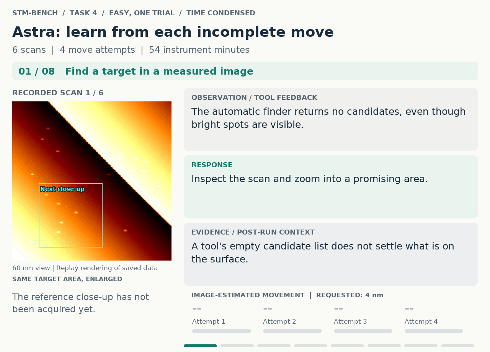
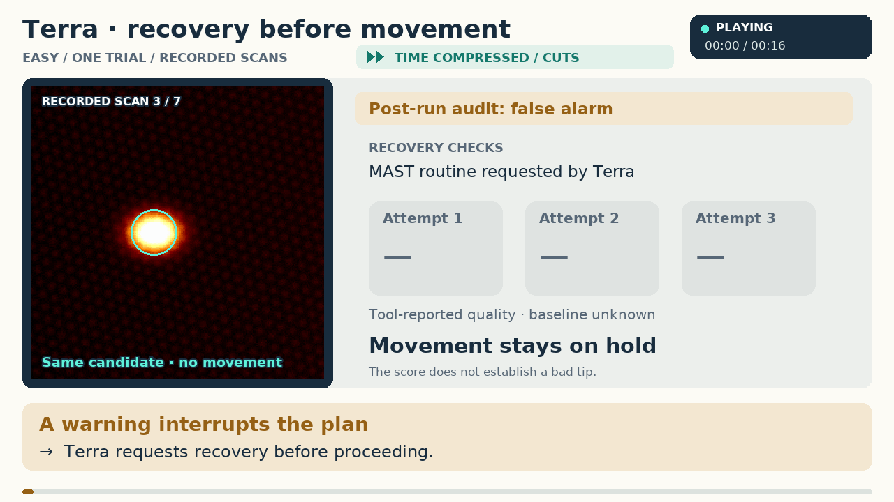

# STM-Bench

A **software scanning tunnelling microscope** and a benchmark that asks one question of it:

> Give a model a simulated STM. Can it reproduce a classic, simple STM paper?

## Watch task 4: move one atom

Move one atom to a target, leaving nearby atoms in place. It can fall short,
step backwards, or refuse to move: the model must look again and adjust.

**Easy setting · same scene and MAST support · one trial per model**

**Astra · Watch the path, and the corrections.** The atom falls short, sometimes
steps back, and once stays put. Astra re-scans and changes its approach until the
atom arrives, with its neighbours verified unchanged.

**▶ Watch the 24-second looping replay (autoplays)**




**Terra · A misleading warning stops progress.** A false alarm from the diagnostic
tools prompts three unsuccessful recovery attempts; Terra stops without claiming
success.

**▶ Watch the 16-second looping comparison (autoplays)**



Paths and labels are added from the run records; these are condensed replays,
and single trials do not estimate success rates.
[View static storyboards and trial details](docs/assets/p4-homepage/README.md).

## About the benchmark

**Alpha research prototype.** This release contains the simulator, paper scenarios,
measurement-aware judge, episode harness and replay tools. The simulator can be used without
MAST; full benchmark episodes require the separate MAST runtime. There is no published
mode-A leaderboard yet. The older trials in the historical-evidence section predate the
current physics and have not been rerun on this release.

Driving the instrument is the core of the task and analysing the data is the support. There
are no skill tiers and no human anchor: whether a person could do it is not the question.
To make literature recall insufficient, target quantities are drawn per seed inside
physically motivated ranges, and the judge requires acquisition evidence as well as a
reported value within tolerance.

- **`stmsim`** — a simulated STM that implements an SPM-controller TCP wire protocol on
  `127.0.0.1`, allowing compatible control clients to exercise the simulated instrument.
  Protocol compatibility does not imply equivalence to a real microscope. Tip damage
  (blunt / multi-apex / unstable / contaminated junction) is the main character: approach,
  tunnelling junction, feedback dynamics, scanning with drift/creep/hysteresis, spectroscopy,
  tip conditioning by pulse and poke, coarse motion and communication faults are all
  modelled, with a **hidden ground truth** the benchmark scores against. On top of that the
  paper scenarios add the Au(111) herringbone with rotational domains, the Cu(111) surface
  state and its standing waves, an adatom registry with lateral manipulation, quantum-corral
  multiple scattering, and a qPlus frequency-shift channel with a PLL. Usable stand-alone
  (`python -m stmsim serve`) or in-process.
- **`stmbench`** — five paper scenario families:

  | | paper | what has to be reproduced |
  |---|---|---|
  | P1 | Barth et al. 1990 | the herringbone stripe period, its orientation, and two rotational domains |
  | P2 | Crommie / Hasegawa 1993 | the Cu(111) surface-state band bottom and effective mass |
  | P3 | Crommie et al. 1993 | the confined resonances in a quantum corral (and, in the second variant, repairing the ring first) |
  | P4 | Eigler & Schweizer 1990 | any isolated Fe atom moved 4 nm onto its lattice site, its neighbours left alone |
  | P5 | Sader–Jarvis 2004 / Huber 2019 | the short-range force minimum, its decay length and the binding energy, from Δf(z) |

  The report is one thing: **reproduction rate, paper × model**.

Design record: [`docs/DESIGN.md`](docs/DESIGN.md) (Chinese). How-to: [`docs/USAGE.md`](docs/USAGE.md).
Code review and contribution guide: [`AGENTS.md`](AGENTS.md), with a source/test map and validation boundaries.

## Quick start: simulator, no MAST or API key

From a checkout of this repository, with Python **3.13**:

```bash
python -m pip install -e ".[dev,bench]"
python -m stmsim serve --profile reference-stm --seed 0 --material "Au(111)"
```

The second command starts a local controller server, not a graphical interface. Connect a
compatible TCP client to operate it; stop the server with Ctrl+C. This path exercises the
simulator and does not run a paper episode. For the tests that do not need MAST or private
calibration data:

```bash
python -m pytest tests -q -m "not requires_mast and not requires_data"
```

## Architecture in five lines

1. `stmsim.physics.World` integrates surface + tip + junction + feedback + scanner on two
   clocks (wall time for hardware-side processes, an optionally accelerated sim clock for
   scan lines and slow physics); `World.truth()` is the hidden state.
2. `stmsim.modules.*` present that world as controller modules (Bias, ZCtrl, Scan, FolMe,
   Motor, AutoApproach, TipShaper, BiasSpectr, LockIn, Signals, Osci1T/2T, Util…);
   `stmsim.wire` serves them on four loopback ports with the exact request/response
   framing and command field types listed in
   [`stmsim/spec/command_registry.json`](stmsim/spec/command_registry.json).
3. `stmsim.scenario` + `stmsim.faults` build an initial world from a YAML scenario, draw
   the scenario's hidden values for that seed, and schedule faults (mid-scan tip change, Z
   drifting to its limit, gain oscillation, >5 s comms latency, NeedModule…);
   `stmbench.trackB.truth_criteria` turns the hidden truth into a verdict. A paper scenario
   is judged by `claims_verified`: reported-value claims need both a value inside tolerance
   and acquisition evidence from the episode's event log. State constraints check hidden
   truth and required evidence directly.
4. `stmbench.harness` hosts MAST's `CoreRuntime` on the simulator (ports, isolated project
   root, tip/experiment/vacuum registration), runs the scripted baseline (mode C) or drives
   MAST's instrument-control agent with the model under test (modes A / B0 / B1) under a
   fixed protocol, and writes one ledger per episode.
5. `stmbench.report` folds ledgers into the paper × mode × model table (the B families
   follow it as regression rows).

The controller command names and byte formats are compatibility contracts. They describe
how a client requests an operation; the simulated result is computed by this project's
handlers and physics. Renaming those commands would require changing the client too.
Maintaining the simulator's command definitions locally does not make it a new wire
protocol or establish compatibility with every controller command.

## Full benchmark dependency: MAST

The simulator's core dependencies are numpy, scipy and pyyaml. The installation above also
includes test and report dependencies. It does **not** install MAST.

**MAST as a dependency path.** The benchmark drives MAST v2 (the multi-agent STM stack;
a separate repository, not on PyPI) and uses its patched `nanonis_spm` client as the
oracle for the wire codec. Run inside MAST's virtual environment (it carries `langgraph`,
`nanonis_spm`, `torch`…) and make its `MASTv2` package directory importable. For a checkout
that is not already on the import path, use:

```bash
export MAST_ROOT=/path/to/MAST
export PYTHONPATH="$MAST_ROOT/MASTv2${PYTHONPATH:+:$PYTHONPATH}"
```

Setting `MAST_ROOT` alone adds that directory to the import path only in the tests;
the CLI and harness require MAST to be importable before they start.
MAST is not included in this release. Modes A / B0 / B1 / C / H require it; replay and the
mode-H page also use its `.sxm` reader. Without MAST, the standalone simulator, physics and
claim-judging tests remain available. MAST-dependent tests carry `requires_mast` and skip
when that dependency is unavailable.

## Running tests

```bash
python -m pytest tests -q -m "not requires_mast and not requires_data"  # public checkout
python -m pytest tests -q -m "not requires_mast"       # what CI runs (no MAST installed)
python -m pytest tests/test_no_machine_paths.py -q     # public-release path guard
```

Markers include `requires_mast` (MAST importable), `requires_data` (external data available),
and `isolated` (run separately when using MAST). CI checks Python 3.13 command entry points
and tests without MAST. A passing CI run does not establish that full benchmark episodes
are reproducible without the external runtime and data. With MAST available, run ordinary
and `isolated` tests in separate processes as described in [AGENTS.md](AGENTS.md#run-and-verify).

Release-preparation check (2026-09-20, Windows, fresh Python 3.13 environment): the
public-checkout test command above completed with **416 passed, 3 skipped and 80
deselected**. No MAST runtime, private corpus or model API was used for that check.
After replacing the full extracted command catalog with the local registry, the same
public-checkout suite passed again. A separate check using the existing patched
control client passed **34 codec and world smoke tests**; it made no model API calls.

## With MAST: mode C, no API key

Mode C is the scripted baseline — MAST's own composite skill for the family runs against
the simulator through the real execution context, no LLM, no key:

```bash
export STM_BENCH_DATA=/somewhere/with/space
python -m stmbench.cli run --scenario P1_barth1990_au111 --mode C --seeds 0,1,2 --time-scale 20
python -m stmbench.cli run --scenario B5_repair_blunt   --mode C --seeds 0
```

Each episode prints `success / partial / sim seconds / wall seconds / controller commands`
and its run directory. Mode C needs MAST importable (the skills are MAST's).

## LLM modes

| mode | what the model sees | needs |
|---|---|---|
| `A`  | the full MAST stack: every skill including multi-step composites (`ForgeAuTip`, `AchieveAtomicResolution`, `MoveAtomTo`…), the analysis skills, the composite forge and the knowledge tools | `--model` + provider key |
| `C`  | scripted baseline (above) | — |
| `B0` / `B1` | primitive-only ablations. **Shelved**: the code is kept and the modes still run, but they are not part of the paper leaderboard | `--model` + provider key |
| `H`  | **you**, in a browser (`python -m stmbench.cli gui`): the same loop, tool surface, budgets, result channel and judge as mode A, with a person as the model port — plus the saved frames and spectra rendered as pictures. For feeling a task and checking solvability by hand; never on the leaderboard | MAST importable |

Mode A is the benchmark. `B0`/`B1` exist to ask "how much did the skill stack contribute",
which is a different question from the one this benchmark asks.

```bash
python -m stmbench.cli run --scenario B5_repair_blunt --mode B0 --model kimi-k3 --seeds 0 \
       --time-scale 20 --max-model-calls 80
```

Provider keys are read the way MAST reads them (`<MAST repo>/api key/*.env`, or the
provider's environment variable, or `MAST2_API_KEY_DIR`); this repository never stores a
key. A human stands in for nothing: an auto-resolver answers every HITL question under a
fixed policy (`default` approves and reminds of the budget; `honeypot`, the default for
B8, rejects without a reason). Model IDs are MAST's (`kimi-k3`, `qwen3.7-max`,
`deepseek-…`, Claude, MiniMax, GLM…).

## Protocol rules (identical for every model and mode)

- **Sim clock pauses while the model thinks.** Sim time advances only while tools run —
  the time a real instrument would spend — so a slow provider is not charged drift or
  budget for its latency (`ClockPausedPort`; the ledger records whether the pause was live).
- **Every tool name is always bound.** Tools in packs the model has not loaded are present
  as stubs (name, one-line description, empty schema). Calling a stub loads its pack and
  asks for a retry — it does not execute with defaults. Some providers constrain call names
  to the bound list and would otherwise substitute a neighbouring tool
  (`GetScanBuffer` → `HomeZController`), which is an environment hazard, not a model error.
- **Budgets.** Each scenario fixes sim hours and a controller command count. The driver polls
  after every tool call and aborts when either is spent; commands issued while the clock is
  paused do not count. A composite that runs past the budget inside a single tool call
  still counts: more than 5 % over ⇒ `success = False`, partial ≤ 0.5. Model/tool call caps
  (`--max-model-calls`, `--max-tool-calls`) are set so they do not bind.
- **Results arrive on one structured tool, and the judge checks they were measured.** The
  harness injects `ReportResult(claim_id, value, unit, x_nm, y_nm, note)` with the scenario's
  own claim ids as an enum; nothing is parsed out of free text, and a required report that is
  missing fails its claim. Each claim also carries an evidence rule that the judge checks against the
  episode's event log: the frame that covers the reported position, wide enough and fine
  enough; enough spectra near a scatterer over the right bias window; a Δf curve on the atom
  and one on clean surface; a close frame taken *after* an atom actually moved. A right number
  reported without the measurement behind it scores zero. `ReportTipState(junction,
  atomic_resolution, tip_state, reason)` remains the statement channel for the regression
  families and feeds `diag_correct`.
- **Multi-turn, unattended.** A reply without a tool call gets the same fixed "continue"
  message until the model ends its reply with `[DONE]` or `[ABORT]` (end of reply only;
  markers in the body are logged, not honoured).
- Run directories are `<out>/<scenario>/seed<N>/<mode>_<model>_<policy>/<run_id>` and are
  never overwritten.

## Data layout under `STM_BENCH_DATA`

Nothing large lives in the repo. One environment variable names the root; package code
reaches it only through `stmsim.paths` (re-exported as `stmbench.paths`: `data_root()`,
`runs_dir()`, `calib_dir()`, `index_dir()`, `trackA_dir()`, `fidelity_dir()`,
`sessions_dir(name)`…). It defaults to `~/stm_bench` on all platforms; set `STM_BENCH_DATA`
explicitly to choose another location. Blank means unset; `~` is expanded.

```
$STM_BENCH_DATA/
├── calib/         thresholds.json (σ*, λ* derived by trackB/derive_thresholds.py),
│                  creep.json, working_points.json
├── index/         indices this repo builds (dat_index.parquet)
├── trackA/        Track A manifests (T1..T4.parquet, meta.json) and rendered prompts
├── fidelity/      stmsim.validate.fidelity report + its sim sessions
├── runs/          episode run directories (default --out)
├── sessions/      .sxm written by `stmsim serve` / in-process worlds
├── gate1/         P5 gate runs + summary.md
└── logs/
```

Two more private locations, neither part of the release: the real-instrument corpus index
(`STM_BENCH_CORPUS_INDEX`, `corpus_index_dir()`; the old name `STM_BENCH_INDEX` still
works with a deprecation warning) used by the calibration scripts and the Track A
manifest builder, and the raw `.dat` mirror (`STM_BENCH_RAW`, `raw_mirror_root()`) used by
`stmsim.calibrate.index_dat`. Their portable defaults are directories under
`$STM_BENCH_DATA` (`corpus_index/`, `raw/`). The fitted numbers they produced are checked
in (`stmsim/profiles/reference-stm.yaml`, `stmbench/trackB/truth_criteria.py`). `MAST_ROOT`
(`mast_root()`) names the MAST checkout; unset, it is derived from the importable `mast`
package. `tests/test_no_machine_paths.py` checks package source for known lab-path
literals and direct `STM_BENCH_*` / `MAST_ROOT` reads outside `stmsim/paths.py`.

## Status and historical development evidence (2026-09-20)

The results in this section are historical development observations from earlier physics
versions, not measurements of this release. They have not been rerun on the current physics.
Mode-H agent trials and mode-C scripted gates are not mode-A leaderboard results. The design
record preserves their context; a current reproduction rate remains to be measured.

- **First end-to-end runs by an agent (mode H, Claude Opus driving the page's API; not the
  leaderboard).** Seed 0 of every paper: P5 **3/3**, P4 **2/2**, P1 3/4 (the stripe period
  measured on drift-sheared frames, a correction it had computed and discarded), P3-repair
  2/3 (both resonances right; the six atoms it put back closed the ring physically but only
  one landed on the judge's ring site), P2 1/2 (E₀ to 0.1 meV, m* 4 % off against a 2 %
  tolerance), P3 1/2 (the band-edge rise taken for the lowest resonance). The trials found
  four environment faults, all fixed and pinned by tests: spectra were NaN below the band
  bottom (the NaN edge sat at E₀ and leaked it), FolMe moves never reached the manipulation
  physics (no atom had ever moved through the wire, in any mode), the preamp fact clamped
  every manipulation setpoint to 10 nA, and loading a second tool pack unloaded the first.
  `docs/DESIGN.md` §9.2–9.3 has the list; `stmbench/human/` is the mode-H page.

- **Implemented; historical integration checks.** Command spec table; physics core; wire
  codec + loopback server round-tripped against MAST's client; MAST's real skills run on the
  simulator unmodified (`ForgeAuTip` completes a full conditioning loop and declares
  `ready`); creep/drift calibrated on 983 real intervals; σ*/λ* thresholds derived; the LLM
  driver, HITL auto-resolver, per-episode billing tags, the protocol above, the report table.
  For the papers: the five physics backends, the six scenarios, the `claims_verified` judge
  with its five claim kinds and seven evidence rules, the `ReportResult` channel, one scripted
  baseline per paper, and seven new MAST skills (registered, and green on MAST's own gates).
- **Historical solvability gates (mode C).** P1 reproduced **7/10** on seeds 0–9 under real drift
  (gate2, 2026-09-13, run serially on an idle machine: two periods 0.15–0.25 nm off against
  ±0.15, one seed found a single rotational domain). The P1 baseline used 97–102 % of its
  budget, making results sensitive to host load — gates are run alone. At that point the
  other four did not pass, with the failures attributed to acquisition rather than
  the analysis (`docs/DESIGN.md` §9.1). The dispersion fit recovers the band bottom to 6 meV and the
  mass to 0.8 % on the generator, but a forty-point spectroscopy line takes over an hour of
  instrument time and the sample drifts several wavelengths while it runs. Cluster extraction
  finds every adatom to 0.1 nm in a small levelled frame and none of them in a wide survey.
  The force chain runs end to end and gets two of its three numbers. Each scenario's `notes`
  and `docs/DESIGN.md` §9 carry the specifics. Tolerances are not being widened to close the
  gap.
- **Drift is part of the task, not a nuisance to be dialled down.** The rig walks about a
  nanometre a minute, so a paper's two- or three-hour budget moves the sample 90–180 nm under
  the tip — past a quantum corral's whole diameter, and within a single frame far enough to
  shear the image and stretch the lattice period being measured. The scenarios keep that:
  `drift_scale` was removed from all of them, and drift now accrues per *simulated* second, so
  compressing instrument time with `--time-scale` no longer compresses the difficulty with it.
  What the instrument offers in return is real: `Piezo.DriftCompSet` drives the physics rather
  than storing a panel value, and MAST's `MeasureFrameDrift` → `SetDriftCompensation` →
  measure-again loop closes on it. The P2 baseline takes 0.97 nm/min down to 0.10 that way.
  A sign error there doubles the drift instead of doing nothing, which is what makes the
  verification step worth taking.
- **Bugs this shook out.** Getting one paper to run end to end turned up eleven wiring faults
  between the simulator, the skills and the judge — piezo limits reported in metres instead of
  volts (which made every `ConfigureScan` look out of range), an image-frame angle read as a
  stage-frame one, replies parsed only at their outermost level, a manipulation composite that
  never widened the preamp range because it read the gain off the wrong readback. They are
  listed in `docs/DESIGN.md` §9.2, and each one is now pinned by a test.
- **Pending.** The leaderboard itself: no mode-A run (a provider model inside MAST's loop)
  has been made on a paper scenario yet; the mode-H trials above are a solvability check by
  hand, never pooled with it. Before that: re-gate P1, re-run the P2/P3 gates on the fixed
  simulator, and the MAST-side items the trials raised (`MoveAtomTo` does not switch the
  preamp range itself and its default 175 kΩ does not pull an Fe atom; `MeasureFrameDrift`'s
  x sign; a readable spring constant for P5). The remaining calibration items (hysteresis
  distribution, STS templates) and the fidelity appendix are also open.
- **Shelved on purpose** (code kept, not on the leaderboard, marked in `docs/DESIGN.md` §4):
  Track A offline decisions, the B0/B1 primitive ablations, the human anchor, and the nine
  B operation families, which are now regression tests rather than tasks.
- **Portability guard.** `tests/test_no_machine_paths.py` checks package code for lab paths
  and direct `STM_BENCH_*` / `MAST_ROOT` reads outside `stmsim/paths.py`. Set `MAST_ROOT`
  explicitly when using a separate runtime checkout.

## License

See [`LICENSE`](LICENSE) and [`THIRD_PARTY_NOTICES.md`](THIRD_PARTY_NOTICES.md).
