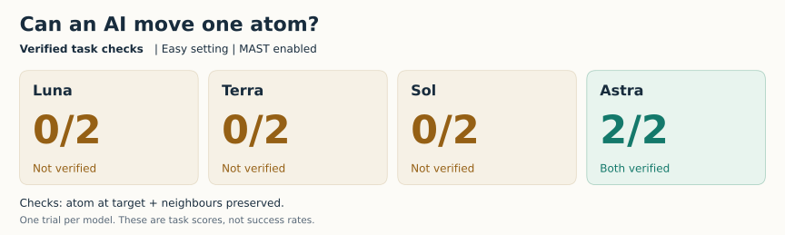
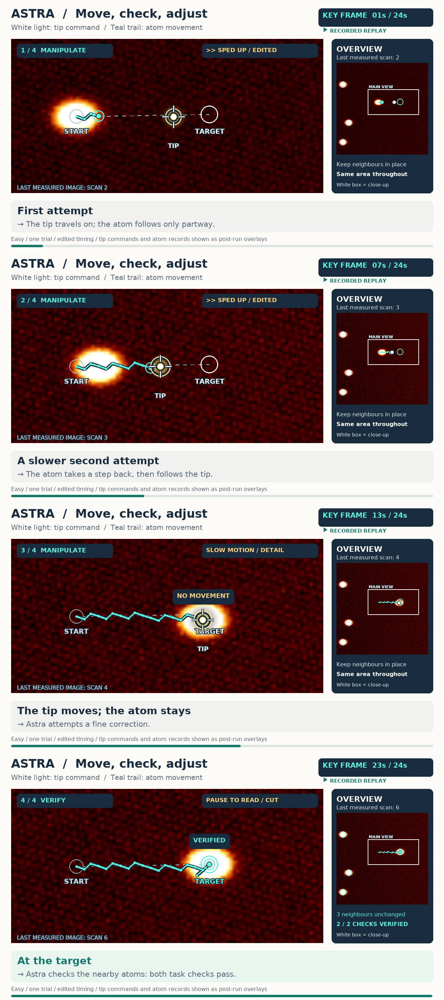
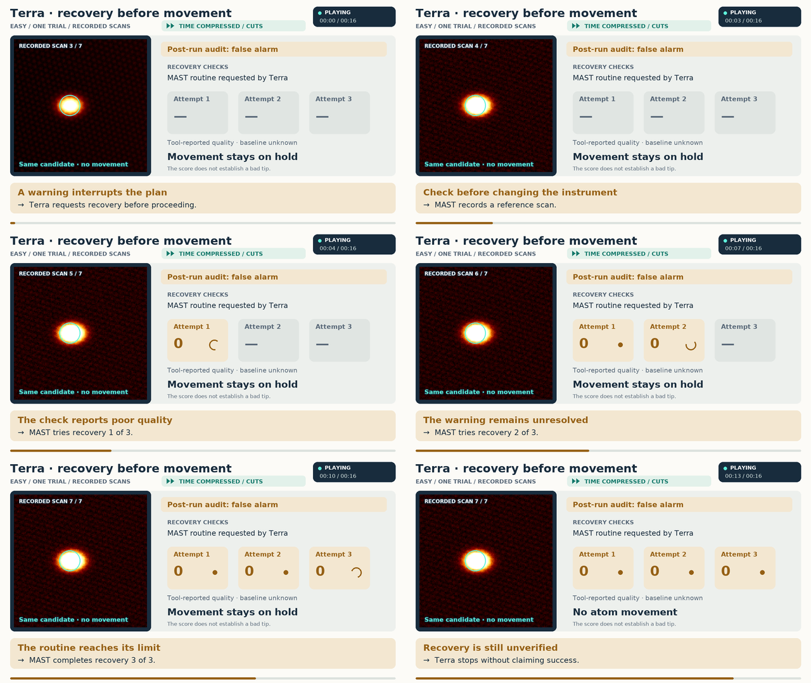

# Task 4: observe, act, check, and adjust

The task is to move one atom to a destination without disturbing its neighbours.
A command does not guarantee a successful move: the model must locate a candidate
in measured images, inspect what happened, and decide whether to change its
settings, try again, or stop. The homepage shows Astra's successful correction
loop and Terra's unsuccessful recovery from a diagnostic warning.



The score counts **two verified task checks**: the atom is at its destination,
and its neighbours are preserved. Verification includes the required measurement
evidence. An unverified check does not mean a neighbour was moved or damaged.
These single trials do not estimate success rates or establish a model ranking.

## Read the replays at your own pace

The homepage loops take about **24 seconds for Astra** and **16 seconds for
Terra**. A playing indicator and progress bar make their animation visible
immediately. The static storyboards let readers inspect the same decisions
without waiting for a loop. The scan panels are replay renderings of acquired
simulated scans, not pixel-identical copies of the agent's interface.
Explanatory annotations were added after the episode and were not guidance
supplied to the models.

### Astra: success requires repeated measurement



[Animation](astra-replay.gif) · [Final frame](astra-replay.png)

The animation begins after Astra has located an atom. A white/gold light shows
commanded tip motion; the teal trail shows the atom's recorded movement. A fixed
overview keeps all four atoms visible and marks the enlarged main view. Four
attempts alternate **manipulation and rescanning**, with pauses for adjustments
and final verification. The model chose its adjustments from scans, without seeing these
retrospective overlays.

| Stage | Saved scan | What the record establishes |
|---|---:|---|
| Search and inspect | 1–2 | An overview is followed by a closer scan of the chosen region. |
| First move falls short | 3 | The first attempt produces three recorded atom hops, far short of the requested destination. |
| Adjust and measure again | 4 | A slower move produces 16 hops and brings the atom close to the destination. |
| A correction changes nothing | 5 | The third attempt records no atom hops. Another scan establishes that outcome. |
| Adjust again and verify | 6 | The fourth attempt produces three hops. The final report and required evidence pass both task checks. |

There were **four move attempts, six saved scans, and about 54 simulated instrument
minutes**. The 22 recorded hops include backwards steps and revisits; they are not
22 distinct sites or a count of successful commands. Each manipulation attempt
was followed by a scan. The final atom position matches the target, and the three
relevant neighbours remain in place.

### Terra: recovery from an imperfect diagnostic



[Animation](terra-replay.gif) · [Final frame](terra-replay.png)

**The warning was a false alarm.** This episode exposes a limitation in MAST's
diagnostic tools; it is not evidence that the physical tip became unstable. The
reported image-quality scores also cannot be treated as the true tip quality.

| Stage | Saved scan | What the record establishes |
|---|---:|---|
| Search the surface | 1–2 | Terra acquires two views, runs feature detection, and exports measured data to locate a candidate. |
| Inspect a candidate | 3 | A closer view contains a real, isolated atom. Image analysis flags a possible tip change, and Terra reports the tip as unstable. |
| Assess before recovery | 4 | The conditioning tool acquires an assessment scan before applying a pulse. |
| Try three recovery steps | 5–7 | Each pulse is followed by a complete scan. The tool reports quality zero and never reaches its requested threshold. |
| Stop without a result | 7 | Terra ends the episode without moving an atom or submitting a completion report. |

The post-episode audit reproduced the warning near image row 119, but the
simulator's tip history contains no corresponding change. The first recorded
tip events are the later recovery pulses themselves. All three pulses have the
recorded outcome `no_effect`: the tip's single-apex shape remains unchanged,
although its length changes.

The model's final report confirms receiving a tip-change warning. The original
analysis reply is truncated before its details; row 119 comes from the later
diagnostic reproduction, not a retained original reading.

The retained recovery summary records three post-pulse scores of zero. Its
baseline score was not retained, so the replay shows that value as unknown.
The offline re-evaluation below is separate from those recorded tool results.

Offline evaluation of all seven saved scans also returned zero from the quality
metric: its sampled angular ring had fewer pixels than the required bins, which
caused an early zero return. That score does not establish a bad tip. The saved
tool replies are truncated, so additional evaluation errors during the episode
cannot be excluded. Terra attempted recovery, but neither it nor the support
tools resolved the misleading diagnosis.

## All four outcomes

| Model | Verified checks | Recorded atom hops | Saved scans | Recorded outcome |
|---|---:|---:|---:|---|
| Luna (`gpt-5.6-luna`) | 0/2 | 0 | 3 | Completed scans and detector retries, then reported an unconfirmed move from a location without an atom. |
| Terra (`gpt-5.6-terra`) | 0/2 | 0 | 7 | Attempted recovery after a false diagnostic warning; stopped without a result. |
| Sol (`gpt-5.6-sol`) | 0/2 | 0 | 1 | Located a plausible candidate but did not recover from parameter errors obscured by generic tool messages. |
| Astra (`gpt-6-astra`) | 2/2 | 22 | 6 | Repeated measurement and adjustment; both checks independently verified. |

Luna's detector eventually returned 218 heuristic candidates, but these did not
establish a valid atom at its chosen start. Its move tool returned an unconfirmed
result; the model nevertheless submitted both claims. This is a localization
and verification failure, with imperfect tool feedback also relevant. Sol's
rejected calls contained actual parameter errors; its failure is not evidence
that valid commands were rejected. Neither Terra nor Sol claimed completion.

## Trial conditions and provenance

Recorded **20–21 September 2026 (UTC)**. These are one-seed development trials,
not a published mode-A leaderboard. **High difficulty was not tested in these
episodes.** The recorded experimental build is identified by its source
fingerprints in [results.json](results.json).

| Setting | Recorded value |
|---|---|
| Scenario | `P4_atom_positioning_cu111` |
| Difficulty / seed | `easy` / `0` |
| Driver | External model through the mode-H interface |
| MAST | Enabled; recorded support source held fixed |
| Model contexts | Fresh; no historical solutions or parent strategy feedback |
| Trials | Serial, one per model |
| Instrument budget | 5,400 simulated seconds; 200,000 controller commands |
| External-agent limits | 80 actions or 20 wall-clock minutes |

The easy profile begins with a sharp tip, disables linear drift and creep, and
scales electronic noise amplitude to 0.25. Stochastic manipulation, lattice
constraints, finite capture range and differences between atoms remain active.
The images still have measurement structure and noise. **Changes of view between
scans are commanded reframing or zooming, not evidence of drift.** These replays
do not demonstrate recovery from a poor starting tip or a drifting sample.

Observation limits were procedural, not operating-system isolation. Model
thinking paused the instrument clock. The instrument time quoted above is not
model response latency, animation duration, or a model speed comparison.

| Model | Run ID |
|---|---|
| Luna | `20260920T151024.658Z` |
| Terra | `20260920T153441.078Z` |
| Sol | `20260920T154740.074Z` |
| Astra | `20260921T065308.969Z` |

Recorded source fingerprints:

- Simulator and benchmark: `164f01def8cb16886d6110cb55d34aa8edaa28789d8131ecc313b4ece02f1ccc`.
- MAST support: `12e93759433aea0b93a46faa24134dd002ce4ad1848e4f30e70062f9ba01c8bc`.

The MAST fingerprint covers the source subtrees recorded by the harness, not
the entire environment. The aggregate data also includes hashes of the original
episode records.

## How these replays are made

These are **condensed, annotated replays of recorded simulated measurements**.
The scan panels use the PNG renderings extracted from the existing replays of
acquired scans, without adding noise or painting a different result. The derived
images are in [scans/](scans/); image provenance and supporting event summaries
are in [replay-evidence.json](replay-evidence.json).

Astra uses a fixed crop in sample coordinates and a permanent overview of all
four atoms, with a rectangle marking the main view. Recorded scans 2–6 replace
the backgrounds only at completed-scan checkpoints. Between scans, the image can
still show the atom at its previous measured position while the overlay advances:
that is a held measurement, not a second atom or a live camera image.

The two moving markers have different sources:

- **Teal atom:** the 22 logged hops in [replay-data.json](replay-data.json),
  including backwards steps and revisits. Atom positions are never interpolated.
- **White/gold tip light:** interpolation between 93 successful command
  destinations in [tip-motion.json](tip-motion.json). These are command parameters,
  not position readbacks or a measured continuous tip path. Their approximate
  timestamps do not establish exact motion onset or synchronization with every
  atom hop; the source file records the timing reconstruction and its limits.

Astra's 24-second loop contains 480 frames at 20 frames per second. Each recorded
512-second verification scan occupies exactly one replay second, labelled
**512× fast-forward**. The first two manipulations are labelled **sped up / edited**;
the last two are **slow motion / detail**. Reading pauses and cuts are labelled,
and model thinking time is omitted. Terra retains 80 frames over 16 seconds with
a persistent **time compressed / cuts** label. These edited loops do not compare
model speed or reproduce a continuous experiment clock.

Paths, destination markers and neighbour circles are post-episode annotations
unavailable to the models. Playback pulses are display cues, not physical
vibration. Terra uses recorded scans and recovery events without an invented
atom trajectory. The positional file also retains older Luna data. Narration
and playback phases are recorded in the schema-3 Astra
[replay-scenes.json](replay-scenes.json) and [terra-scenes.json](terra-scenes.json).
Rounded image estimates remain separate from the simulator's hop coordinates.

The original ledgers remain unchanged. Raw acquisition files, full private
ledgers, machine paths, and credentials are not published in these assets.
The four-model scorecard remains based on [results.json](results.json); this
presentation update does not change scores, experimental conditions, or episode
records.

Regenerate the assets with Python, Matplotlib and Pillow installed:

```bash
python docs/assets/p4-homepage/generate_results.py
python docs/assets/p4-homepage/generate_replays.py
```

The generators render existing evidence; they do not rerun the experiments.
`generate_replays.py` also calls `render_terra.py` for the recovery comparison.
To re-extract the scan PNGs and provenance from the original standalone replay
files, run `export_evidence.py --replay-dir <replay-directory>` from this folder.
Regenerating the figures themselves uses the included images and JSON only.
The root README uses relative image links and requires no live instrument
connection or embedded script.
