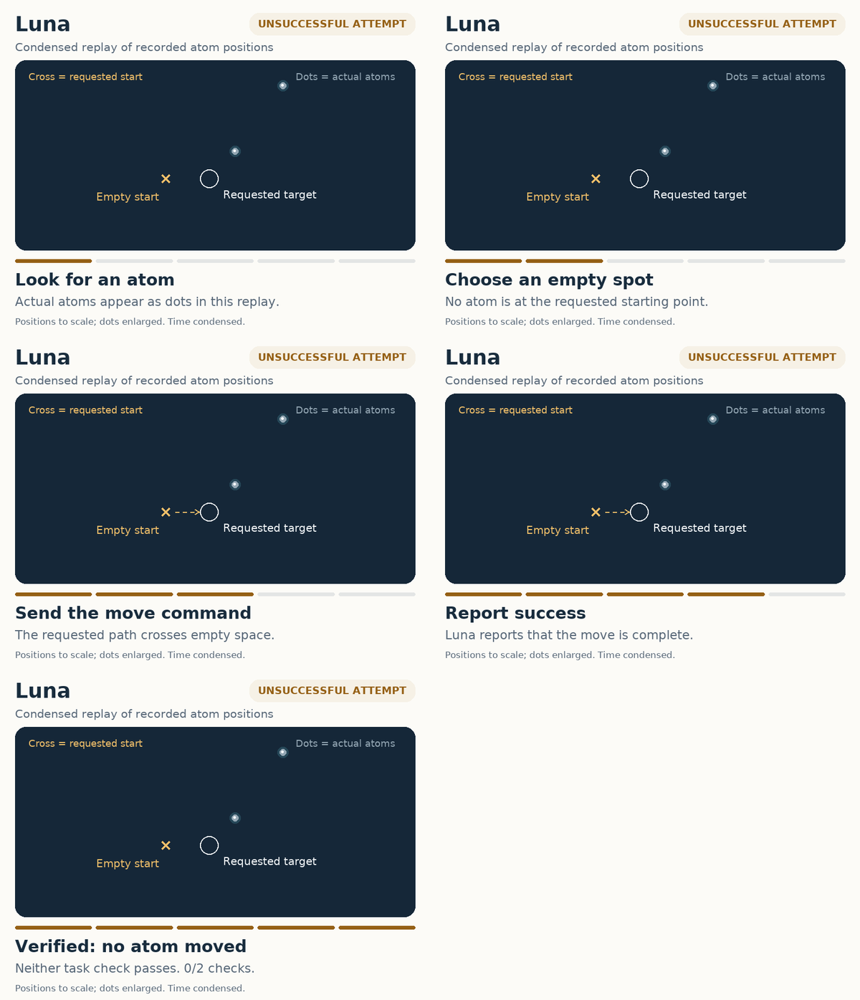

# Task 4: move one atom

Move one atom to the requested destination without disturbing its neighbours.
The homepage shows two short, contrasting replays from the same starting scene:
Astra checks and adjusts until it succeeds; Luna requests a move from an empty
spot and reports completion, although no atom moves.


The score counts **two verified task checks**: the atom is at its destination,
and its neighbours are preserved. Verification includes the required measurement
evidence. An unverified check does not mean a neighbour was moved or damaged.

## Watch without animation

The storyboards retain every narrative stage of the homepage animations.

### Astra: verified success


[Animation](astra-replay.gif) · [Final frame](astra-replay.png)

### Luna: unsuccessful attempt



[Animation](luna-replay.gif) · [Final frame](luna-replay.png)

## Trial conditions and evidence

Recorded **20–21 September 2026 (UTC)**. These are one-seed development trials,
not success-rate estimates or a published leaderboard. **High difficulty was not
tested in these episodes.** The experimental trial build is identified by its
source fingerprint in [results.json](results.json).

| Setting | Recorded value |
|---|---|
| Scenario | `P4_atom_positioning_cu111` |
| Difficulty / seed | `easy` / `0` |
| Driver | External model through the mode-H interface |
| MAST | Enabled; recorded support source held fixed |
| Model contexts | Fresh; no historical solutions or parent strategy feedback |
| Trials | Serial, one per model |
| Instrument budget | 5,400 simulated seconds; 200,000 controller commands |
| External-agent limits | 80 actions or 20 wall-clock minutes |

| Model | Verified checks | Recorded atom hops | Saved scans | Run ID |
|---|---:|---:|---:|---|
| Luna (`gpt-5.6-luna`) | 0/2 | 0 | 3 | `20260920T151024.658Z` |
| Terra (`gpt-5.6-terra`) | 0/2 | 0 | 7 | `20260920T153441.078Z` |
| Sol (`gpt-5.6-sol`) | 0/2 | 0 | 1 | `20260920T154740.074Z` |
| Astra (`gpt-6-astra`) | 2/2 | 22 | 6 | `20260921T065308.969Z` |

The easy profile begins with a sharp tip, disables linear drift and creep, and
reduces electronic noise. Stochastic manipulation, lattice constraints, finite
capture range and differences between atoms remain active. Observation limits
are procedural, not operating-system isolation. The MAST support fingerprint
covers the source subtrees recorded by the harness, not the entire environment.

The task allows **any isolated atom**. Astra selected an actual atom and made
four move attempts with 3, 16, 0 and 3 recorded hops, each followed by a scan.
Its final position matches the target, and the three relevant neighbours stay
in place. Luna requested a move from `(0, 0)` to `(4, 0)` nm; its chosen starting
point was empty. It submitted a completion report without any recorded atom
movement. Its neighbour check is unverified because qualifying manipulation
evidence is missing; it is not evidence of damage.

## How the animations are made

These are **simplified post-episode views of recorded simulator positions**, not
microscope footage or a display available to the evaluated models. Positions keep
their spatial scale; dots are enlarged, and each panel shows the area relevant to
that model's attempt. Only Astra has a selected atom highlighted. Luna's cross
and circle mark its requested start and destination, not existing atoms.

Every displayed movement uses a recorded position, including backwards steps and
revisits. There is no interpolated atom motion. Arrows show requested moves, not
measured tip paths. Pauses and time compression are chosen for readability and
must not be used to compare model speed. The animations loop in about 19 seconds
(Astra) and 15 seconds (Luna).

[results.json](results.json) holds aggregate outcomes and hashes of the original
episode records. [replay-data.json](replay-data.json) holds the derived positions,
command intervals and source replay hashes needed to reproduce the animations.
The original records were not modified. Raw acquisition files, private paths,
and model credentials are not included in these assets.

Regenerate the assets with Python, Matplotlib and Pillow installed:

```bash
python docs/assets/p4-homepage/generate_results.py
python docs/assets/p4-homepage/generate_replays.py
```

The generators check the recorded scores, move counts and final target position
before rendering. They do not rerun the experiments. The root README uses only
relative image links to the SVG chart and GIFs; it needs no embedded script,
external hosting or live instrument connection.
